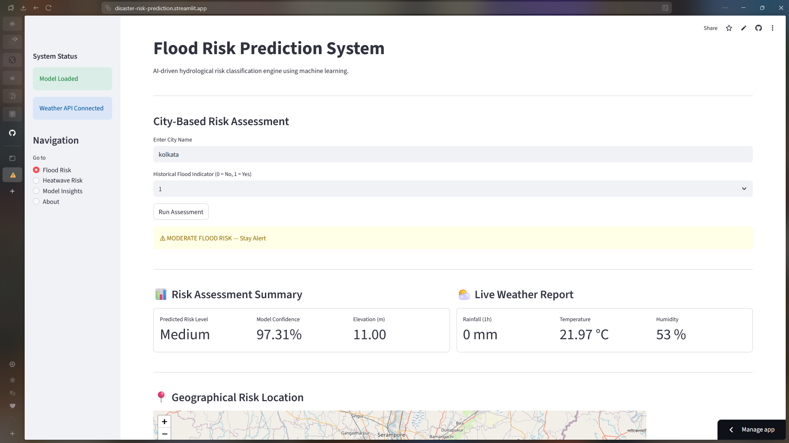
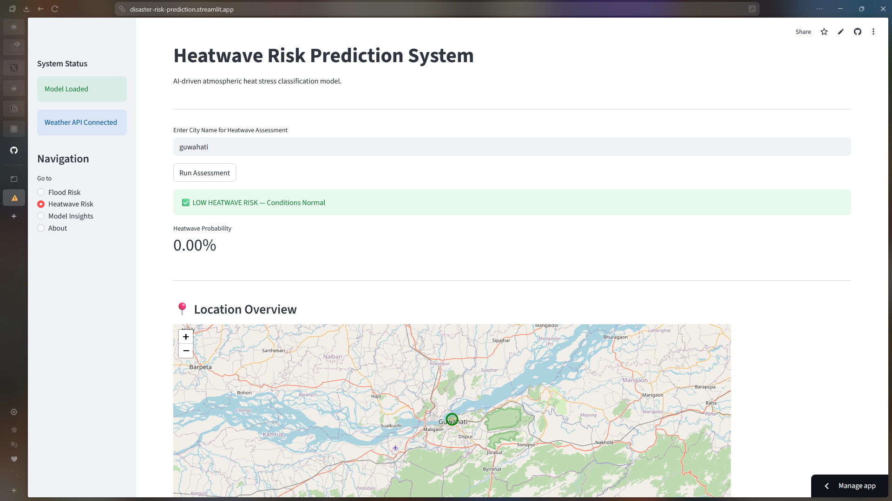

# ⚠️ Multi-Hazard Disaster Risk Prediction System

An end-to-end machine learning system for assessing multiple disaster risks including floods and heatwaves using meteorological and hydrological indicators with advanced machine learning techniques.

---

## 📌 Problem Statement

India experiences frequent natural disasters, with floods and heatwaves being among the most recurring and destructive hazards. Rapid urbanization, climate variability, and changing weather patterns significantly increase the vulnerability of many regions to multiple disaster types.

Early risk assessment based on environmental indicators can help in:

- Proactive multi-hazard disaster preparedness  
- Infrastructure and urban planning  
- Risk-aware decision making  
- Resource allocation during extreme weather events  

This project aims to develop a comprehensive machine learning-based system that predicts disaster risk levels.

---

## 📁 Project Structure

```
Disaster_Risk_Prediction/
├── app.py                              
├── requirements.txt                       
├── README.md                             
├── data/
│   ├── flood_dataset.csv                 
│   └── heatwave_dataset.csv              
├── models/
│   ├── flood_risk_model.pkl             
│   └── heatwave_model.pkl                
└── notebooks/
    ├── flood_model_training.ipynb        
    └── heatwave_model_training.ipynb 
```

---

## 🧠 Methodology

### 🌊 Flood Risk Module

- Hydrological indicators split using a stratified train-test strategy.
- KMeans clustering applied on training data to derive risk categories (Low / Medium / High).
- XGBoost multi-class classifier trained on derived labels.
- Cross-validation used for robust evaluation.
- Feature importance analyzed for interpretability.

---

### 🔥 Heatwave Risk Module

- Heatwave labeled using temperature threshold (≥ 40°C).
- Stratified train-test split to handle class imbalance.
- Direct threshold feature excluded to prevent data leakage.
- Random Forest classifier selected based on F1 performance.
- ROC-AUC and feature importance used for evaluation.

---

## 📊 Model Performance

### Flood Risk Classifier (XGBoost)

| Metric | Value |
|--------|-------|
| Test Accuracy | **98.8%** |
| Macro F1 Score | **0.98** |
| Recall | **0.99** |

**Key Insights:**
- Strong generalization across stratified test split
- Excellent performance on all three risk classes
- Top features: Historical Flood Presence, Water Level, River Discharge

### Heatwave Risk Classifier (Random Forest)

| Metric | Value |
|--------|-------|
| Test Accuracy | 96.5% |
| F1 Score | 91% |
| ROC-AUC | 99% |

**Key Insights:**
- Robust prediction of heat stress conditions
- Balanced precision and recall for early warning capabilities
- Top features: Temperature anomalies, humidity, wind patterns

---

## 💻 Deployment Architecture

The system is deployed using **Streamlit** with a multi-page interface including:

### Pages

1. **Flood Risk Assessment**
   - City-based flood risk prediction
   - Real-time weather data integration
   - Risk probability visualization
   - Geospatial mapping with folium
   - Hydrological indicators dashboard

   

2. **Heatwave Risk Assessment**
   - Atmospheric heat stress prediction
   - Comprehensive weather analytics
   - Heatwave probability metrics
   - Location-based risk visualization
   - Warning system indicators

   

3. **Model Insights**
   - Flood model architecture and methodology
   - Heatwave model approach and rationale
   - Feature importance explanations
   - Validation strategy documentation
   - Algorithm selection justification

4. **About**
   - Project overview
   - ML concepts applied
   - System architecture
   - Development methodology

---

## 🛠 Technology Stack

**Core Machine Learning:**
- Scikit-learn (preprocessing, Random Forest)
- XGBoost (gradient boosting classifier)

**Data Processing:**
- Pandas (data manipulation)
- NumPy (numerical computing)

**Visualization:**
- Matplotlib (statistical plots)
- Folium (geospatial mapping)

**Deployment & APIs:**
- Streamlit (web interface)
- Requests (HTTP client)
- Streamlit-folium (map integration)

**Additional Tools:**
- Joblib (model serialization)
- Python 3.8+

---

## 🌐 API Integration

The system integrates with **OpenWeather API** and **Open-Meteo API** to fetch real-time weather data (rainfall, temperature, humidity) and elevation information, which are used as input features for the flood risk and heatwave risk prediction models to provide accurate, location-based disaster risk assessments.

---

## 🚀 How to Run Locally

### Prerequisites
- Python 3.8 or higher
- Git installed on your system
- Internet connection for API calls

### Installation Steps

1. **Clone the repository**
   ```bash
   git clone https://github.com/logitechsoumili/Disaster_Risk_Prediction.git
   cd Disaster_Risk_Prediction
   ```

2. **Install dependencies**
   ```bash
   pip install -r requirements.txt
   ```

3. **Get OpenWeather API Key**
   - Sign up at [OpenWeather](https://openweathermap.org/api) (free tier available)
   - Copy your API key

4. **Configure Streamlit Secrets**
   - Create `.streamlit/secrets.toml` in the project root:
   ```bash
   mkdir .streamlit
   ```
   - Add your API key to `.streamlit/secrets.toml`:
   ```toml
   OPENWEATHER_API_KEY = "your_api_key_here"
   ```

5. **Run the application**
   ```bash
   streamlit run app.py
   ```

The app will open in your default browser at `http://localhost:8501`

---

## 📈 Future Enhancements

- Multi-hazard expansion (Cyclone, Earthquake, Drought modules)
- Integration with real-world meteorological datasets (IMD, NOAA)
- Mobile application for on-the-go risk assessment
- Time-series forecasting with LSTM/Prophet
- Push notifications for high-risk alerts
- Database integration for historical data storage
- Multi-language support for regional deployment